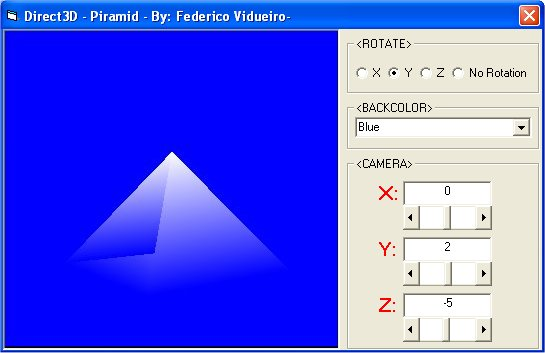



## Updated\! Direct3D Piramid

### Description

It shows how to do 3D graphics with direct3d. It's render a piramid.

This version have:

- Choose BackColor

- Choose axis for rotation or no rotation

- You can move the camera

If you like this code please vote for it.

Feel free to make any comment.

Sorry about my english, I'm from Argentina.
 
### More Info
 

             |
---                |---
**Submitted On**   |2002-04-13 22:39:56
**By**             |[Fedrico Vidueiro](https://github.com/Planet-Source-Code/PSCIndex/blob/master/ByAuthor/fedrico-vidueiro.md)
**Level**          |Intermediate
**User Rating**    |4.4 (22 globes from 5 users)
**Compatibility**  |VB 6\.0
**Category**       |[DirectX](https://github.com/Planet-Source-Code/PSCIndex/blob/master/ByCategory/directx__1-44.md)
**World**          |[Visual Basic](https://github.com/Planet-Source-Code/PSCIndex/blob/master/ByWorld/visual-basic.md)
**Archive File**   |[Updated\!\_D717344132002\.zip](https://github.com/Planet-Source-Code/fedrico-vidueiro-updated-direct3d-piramid__1-33752/archive/master.zip)

